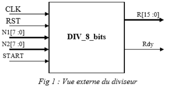
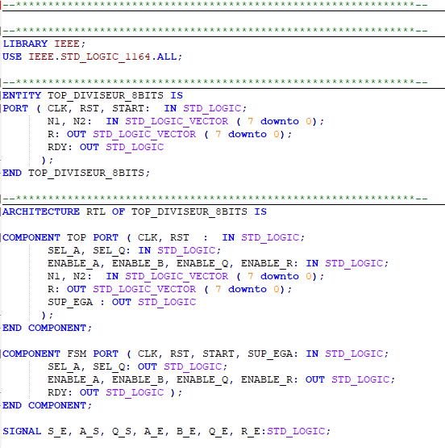

Circuits  Reprogrammables  &  Conception Circuits  Intégrés Numériques En  VHDL** 

1ère ANNÉE GSEIII 

**TP 3 : CONCEPTION D’UN CIRCUIT DIVISEUR SÉQUENTIEL ENTRE DEUX OPERANDES DE 8 BITS EN VHDL**  

1. Objectif : 

Ce TP consiste à spécifier, simuler puis synthétiser un diviseur séquentiel entre deux opérandes de 8 bits et donc un résultat sur 8 bits. 

Une fois le diviseur 8x8 achevé, il vous sera possible de réaliser un diviseur dont la taille des entrées sera définie par un générique. 

2. Spécification du diviseur 8 bits 

La méthode pour diviser les deux opérandes n1 et n2 consiste à effectuer les opérations suivantes : A <= N1, B <= N2. 

A <= A – B 

Q <= Q +1  

- Le passage à 1 du signal START signal le dépôt des opérandes N1 et N2 aux variables A et B. 
- Le circuit accuse réception en passant RDY à 0. Les opérandes sont alors mémorisés en internes et le client peut repasser START à 0. 
- La fin du calcul est signalée par la remontée de RDY à 1. 
- Le résultat est alors disponible sur la sortie R. 
- Le comportement est indéfini si START passe à 1 alors que RDY est à 0. 

Question : 

Définir une description comportementale pour décrire conjointement les aspects algorithmiques et temporels. 

----- Langage c++ : 

3. Modèle architectural en VHDL 

Ce diviseur peut se décomposer dans un premier temps en deux blocs : 

- Partie opérative pour effectuer la division ; 
- Partie de contrôle pour permettre de gérer l’acquisition des opérandes, la gestion des signaux acquittement, d’initialisation, etc… 

Objectif : 

- Guider le processus de synthèse 
- Expliciter un modèle d’architecture  
- Transcription en VHDL structurelle 

**Partie Opérative**  

- Une variable = un registre 
- Une opération = un opérateur (combinatoire) ; 
- Une affectation = un chargement de registre 
- Une conditionnelle (if) = un multiplexeur 

Dessin du « chemin de données » (data-path) 

1. Multiplexeur 2 vers 1 
- Code VHDL de MUX2\_1 

- Test Bench de MUX2\_1 

- Compilation et Simulation 

2. Registre 8 bits 
- Code VHDL du Registre 8 bits 

- Test Bench  

- Compilation et simulation  

3. Comparateur 8 bits 
- Code VHDL du comparateur 8 bits ; 

- Test Bench 

- Compilation et simulation 

4. Soustracteur 8 bits  
- Code VHDL du soustracteur 8 bits 

- Compilation et simulation 

5. Circuit d’incrémentation 8 bits 
- Code VHDL de l’additionneur 8 bits 

\ 

- Test Bench 

- Compilation et simulation 

6. Top de la partie opérative 
- Code VHD du TOP  

- Test Bench 

- Compilation et simulation 

**Partie Contrôle**  

- Sortie : signaux de commande de la P0 : 
  - Fonts (chargements) 
  - Niveaux (sélection) 
- Entrées :  
- Entrées de contrôle du système  
- Indicateur en provenance de la PO. 

Machine d’état : 

- Code VHDL de la partie contrôle : 

- Test Bench 

- Compilation et Simulation 

**TOP Du Diviseur 8 bits** 

Il nous suffit juste de combiner la parte de contrôle avec la partie de commande. 

- Code VHDL du TOP 

- Test Bench 

- Compilation et Simulation 

- Script de compilation + simulation 

4. Modifier ce diviseur pour réaliser un diviseur dont la taille des entrées sera définie par un générique.  

Dans l’architecture du TOP de la partie opérative j’ai utilisé des signaux de taille 16 bits car les signaux intermédiaires doivent avoir la même taille que les sorties de mes circuits. C’est à titre d’exemple que j’ai choisi la taille 16 bits sinon je devrais déclarer les signaux intermédiaires pour (8, 16, 32, 64 bits …)  

Après avoir modifié convenablement tous les fichiers et après l’exécution du test Bench on obtient le résultat suivant :  

NB : Pour la modification voire les fichiers dans le dossier Diviseur\_modifie. 
